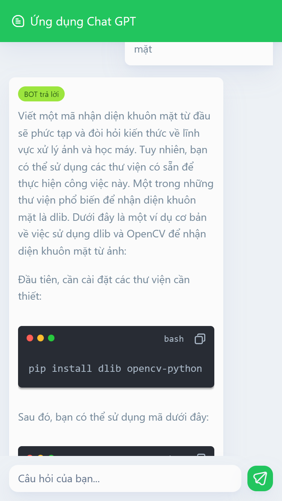

# Ứng dụng chat GPT
### Dự án được viết bằng vuejs + vite, api chatgpt mình lượm trên mạng, sử dụng ionic + capacitor để chạy ứng dụng trên mobile, mọi người có thể download, fork thoải mái,...
# Giao diện

  

